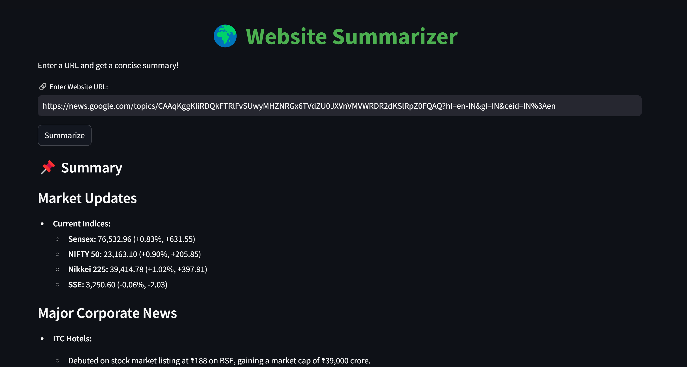

# 🌍 Website Summarizer  

  

## 📌 About  
Website Summarizer is a **Streamlit-based web app** that extracts and summarizes webpage content using **OpenAI GPT-4o-mini** and **BeautifulSoup**.  

🚀 **Key Features:**  
- 🌐 **Scrapes & cleans webpage text** (removes scripts, styles, etc.)  
- ✨ **Summarizes using OpenAI GPT** for quick insights  
- ⚡ **Fast & user-friendly UI** powered by **Streamlit**  
- 🔒 **Secure API Handling** using `.env`  

---

## 🛠️ Installation & Setup  

### **1️⃣ Clone the Repository**  
```sh
git clone https://github.com/Vaibhav-C-S/WebsiteSummarizer.git 
cd website-summarizer
```

### **2️⃣ Install Dependencies**  
```sh
pip install -r requirements.txt
```

### **3️⃣ Set Up OpenAI API Key**  
Create a `.env` file in the project directory and add your OpenAI API key:  
```
OPENAI_API_KEY=your_openai_api_key_here
```

### **4️⃣ Run the App**  
```sh
streamlit run app.py
```

---

## 🎯 Usage  
1. **Enter a website URL** in the text box.  
2. Click **"Summarize"** to get a concise summary.  
3. The **summary appears in a scrollable box** to prevent layout shifts.  

---


